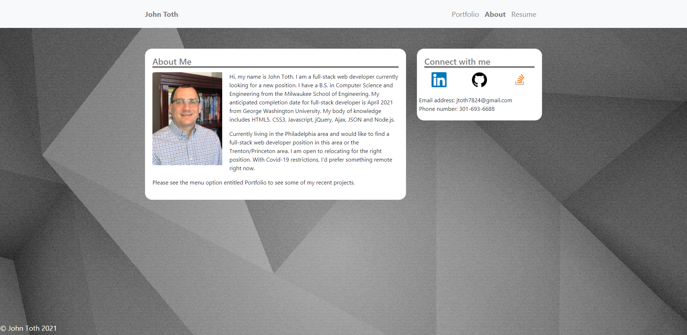
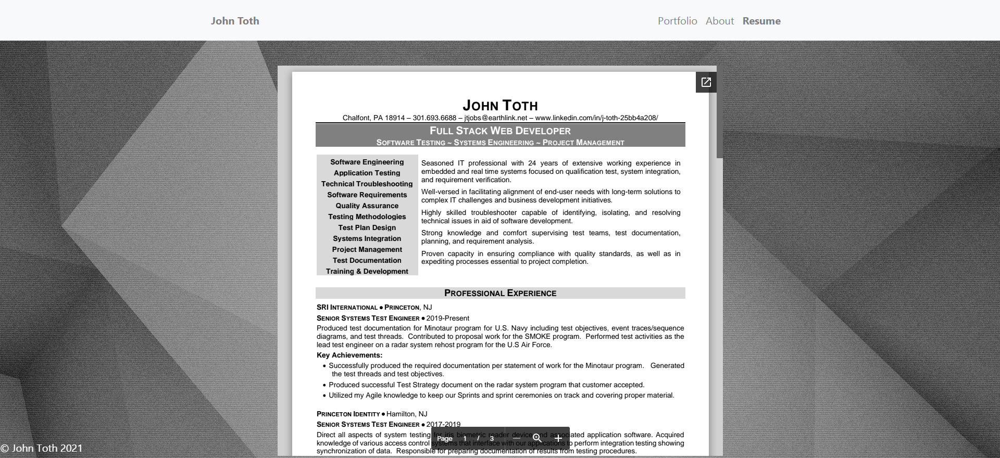
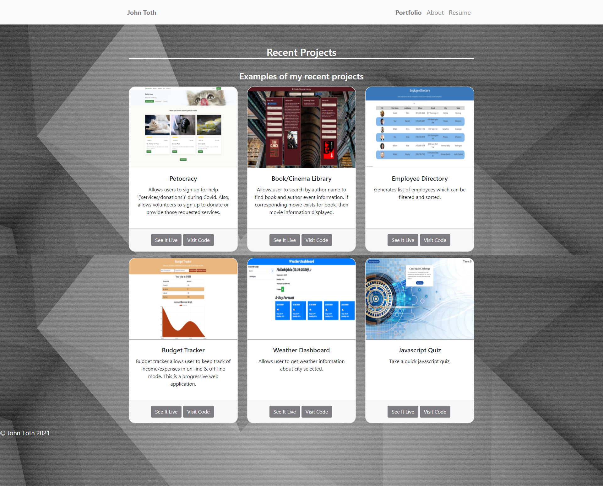

# react_portfolio

This Portfolio contains contact information for me.   It also displays my body of knowledge and information about what I'm looking for.    There is also a link to my recent projects.    For each of these projects there is a screenshot of the application along with buttons to try out the application or to go directly to the GitHub repository for the code.

This application was built using React and utilizes component state.  It also uses a Footer and Header component that are static across all pages in the application.  The projects listed on the portfolio page are all rendered via one component by passing in array of objects.  The application was deployed to Github pages.  Due to the application using a router and being deployed to Github pages it needed to use HashRouter instead of BrowserRouter in order to deploy correctly.

## Table of Contents
* [Screenshots](#Screenshots)
* [Installation](#Installation)
* [Usage](#Usage)
* [Technologies](#Technologies)
* [Repository](#Repository)
* [Deployment](#Deployment)

#### About page
The following is a screenshot of the About Me page of the portfolio application.

  

#### Resume page
The following is a screenshot of the Resume page with embedded PDF.

  

#### Portfolio page
The following is a screenshot of the Portfolio page of the portfolio application.

  

## Installation

* Fork or clone the repo.
* Make sure to install all the dependencies by running the following command:
    * **npm install**

## Usage

To use this application once installed, the user launches the application from a terminal window as follows:

**npm start**

This will then open a browser window at localhost:3000.

The application can alternatively be run as a deployed application following the link in the Deployment section.

## Technologies

* React
* HashRouter
* axios
* Github pages
* Bootstrap
* HTML
* CSS
* Javascript

## Repository

Direct link to repository:  https://github.com/jtoth7824/react_portfolio

## Deployment

The React Portfolio application was deployed to Github Pages so that anyone can run the application.   The link to execute the application is as follows:

https://jtoth7824.github.io/react_portfolio

